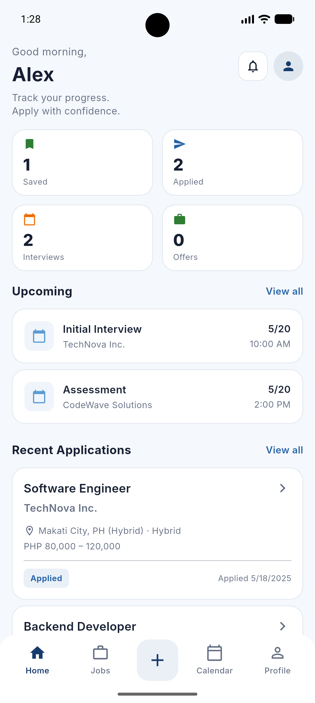
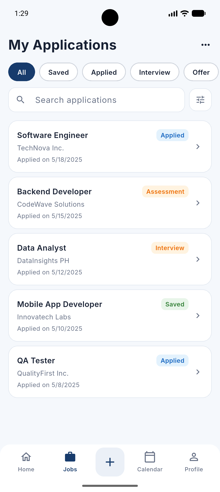
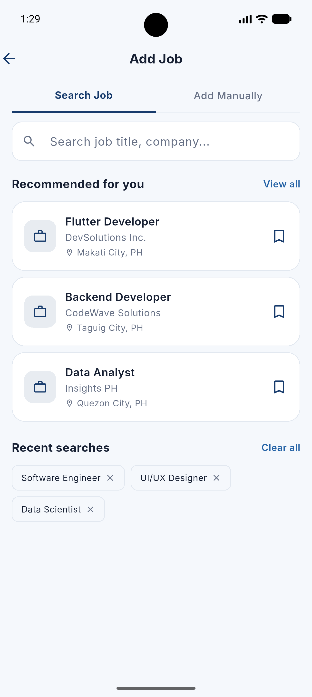
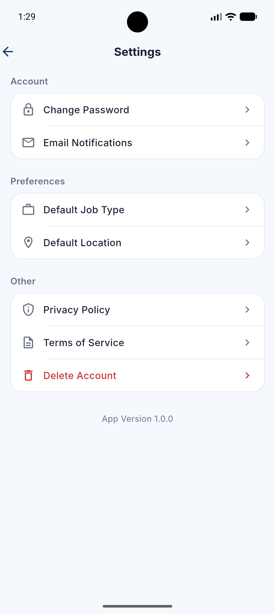
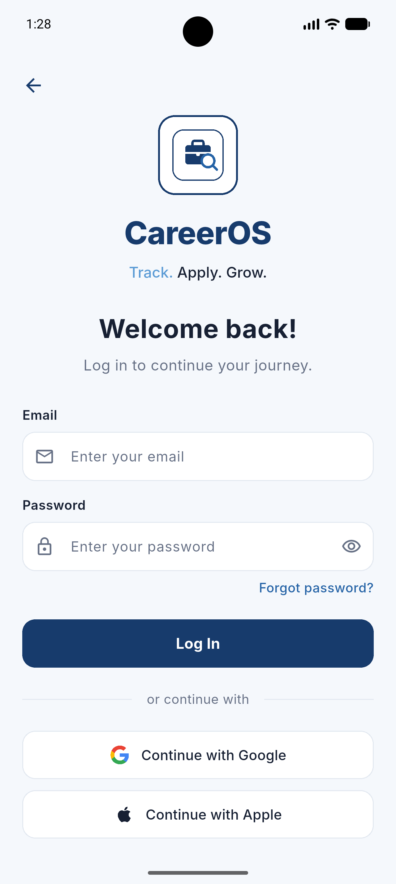

# CareerOS

CareerOS is a Flutter mobile application designed to help job seekers organize applications, track interview progress, manage reminders, and stay focused throughout the job search process.

## Overview

CareerOS brings the job search into one place by combining application tracking, job history, reminders, and progress visibility in a single mobile experience. The app is designed for candidates who want to stay organized without losing track of where each opportunity stands.

The experience centers on a simple workflow:

1. Save or review a job opportunity
2. Track its status through the hiring pipeline
3. Add notes, reminders, and follow-up actions
4. Monitor progress through dashboard and analytics views
5. Keep the search organized and measurable over time

## Key Features

- Job application tracking
- Search and filtering
- Application history
- Notes and job-specific context
- Reminder and follow-up management
- Dashboard metrics
- Analytics and status visibility
- Settings and profile preferences
- Material 3-based mobile UI
- Reusable UI components
- Local application state and data handling

## Screenshots

### Dashboard

### Job Applications

### Add Job

### Settings

### Login

### Additional screens
- Onboarding: screenshots/onBoarding1.png, screenshots/onBoarding2.png, screenshots/onBoarding3.png
- Profile: screenshots/Profile.png
- Calendar: screenshots/Calendar.png
- Sign Up: screenshots/SignUp.png

## Tech Stack

- Flutter
- Dart
- Material 3
- ChangeNotifier-based state management
- Local app storage and persistence
- SharedPreferences-based state handling

## Technical Highlights

- Reusable Flutter UI building blocks
- Centralized state management for app workflows
- Structured job and event models
- Search and filtering across the application pipeline
- Status tracking for saved, applied, assessment, interview, and offer stages
- Dashboard and analytics views based on application data
- Mobile-first design aimed at a clean, practical user experience

## Architecture Overview

The application follows a straightforward mobile app structure:

- UI layer for screens and widgets
- State layer for app-wide coordination
- Model layer for jobs, events, and related data
- Local persistence for stored application state
- App flows that connect job tracking, reminders, and analytics

This repository intentionally presents the project at the portfolio level and does not include the complete private implementation.

## Development Challenges

This project was built to solve common challenges in job search management, including:

- organizing multiple opportunities in a consistent workflow
- tracking evolving application status over time
- maintaining a clear user experience without overwhelming the user
- keeping job-related data structured and searchable
- presenting meaningful metrics for progress and activity

## Future Improvements

Future work may include:

- Firebase authentication and cloud storage
- push notifications
- more advanced job import workflows
- additional analytics and reporting
- improved personalization and filtering
- expanded reminder and follow-up automation

These items are clearly marked as future improvements and are not presented as current functionality.

## Project Status

CareerOS is a real Flutter application project intended for portfolio presentation. The complete implementation remains private, while this public repository focuses on professional presentation, screenshots, architecture narrative, and project context.

## Notes

This public repository is a showcase repository. It is designed to help recruiters and developers understand the project without exposing the full private codebase.
